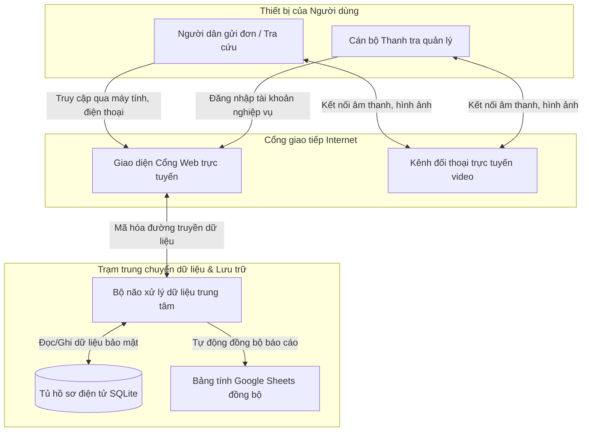
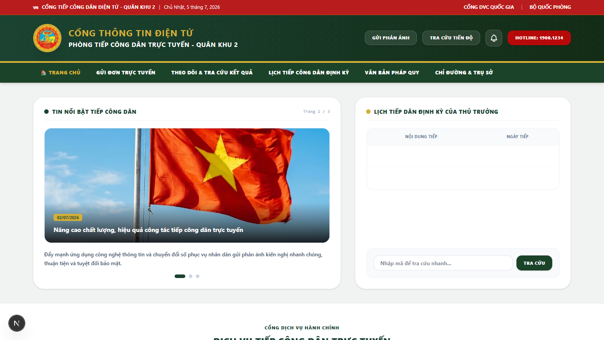
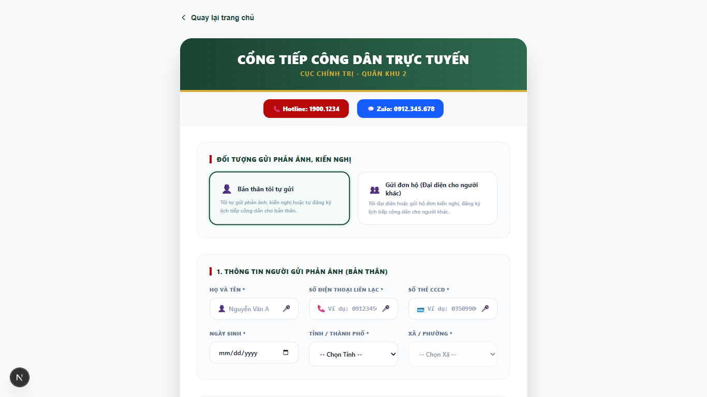
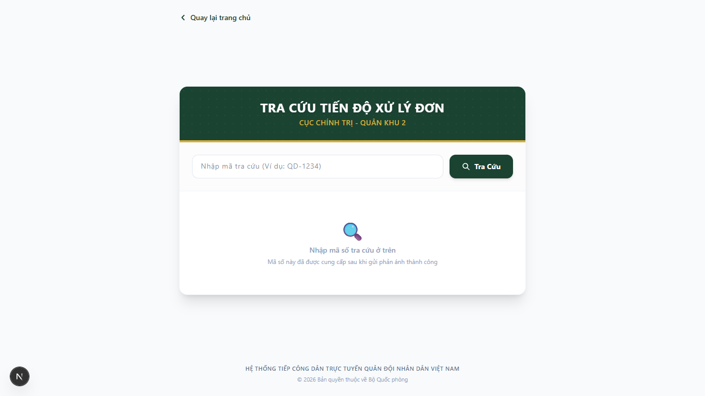
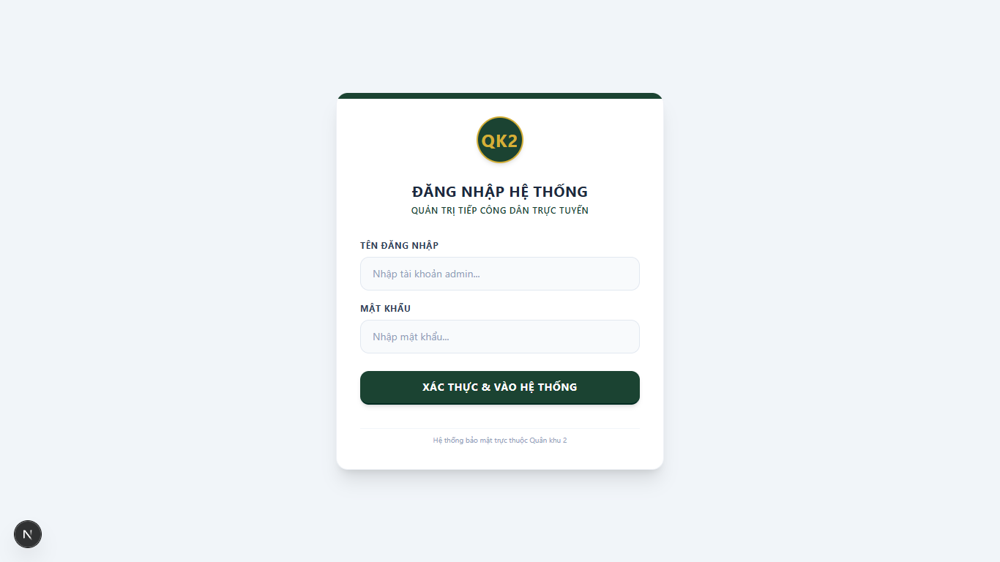

# BỘ QUỐC PHÒNG
## CỤC CHÍNH TRỊ - QUÂN KHU 2
***

# BÁO CÁO THUYẾT TRÌNH DỰ ÁN
## HỆ THỐNG TIẾP CÔNG DÂN ĐIỆN TỬ TRỰC TUYẾN
### CỔNG TIẾP CÔNG DÂN TRỰC TUYẾN — CỤC CHÍNH TRỊ QUÂN KHU 2

**Địa điểm:** Phú Thọ, năm 2026

---

## MỤC LỤC

1. **PHẦN I: THUYẾT MINH PHƯƠNG ÁN KỸ THUẬT & PHƯƠNG THỨC THỰC HIỆN DỰ ÁN**
   - 1.1. Mục tiêu & Lý do xây dựng hệ thống
   - 1.2. Nền tảng công nghệ & Các Khung phát triển (Frameworks) sử dụng
   - 1.3. Sơ đồ khối minh họa hoạt động (Kiến trúc hệ thống dễ hiểu)
   - 1.4. Mô tả chi tiết các tính năng tiện ích cốt lõi
   - 1.5. Quy trình triển khai & Đóng gói hệ thống

2. **PHẦN II: HƯỚNG DẪN SỬ DỤNG CHI TIẾT CÁC TÍNH NĂNG (DẠNG VĂN BẢN TIÊU CHUẨN)**
   - 2.1. Bản đồ cấu trúc và tính năng của trang web công cộng
   - 2.2. Hướng dẫn chi tiết dành cho Người dân (Công dân sử dụng)
   - 2.3. Hướng dẫn chi tiết dành cho Cán bộ quản lý (Trang Quản trị)

3. **PHẦN III: QUY CHẾ BẢO MẬT & ĐỊNH HƯỚNG PHÁT TRIỂN**
   - 3.1. An toàn thông tin quân sự & Tính riêng tư dữ liệu
   - 3.2. Định hướng nâng cấp trong tương lai

4. **PHẦN IV: HƯỚNG DẪN XÂY DỰNG SẢN PHẨM & DỰ TOÁN CHI PHÍ DUY TRÌ**
   - 4.1. Quy trình các bước làm ra sản phẩm
   - 4.2. Hướng dẫn kỹ thuật: Cách tạo trang & thêm các mục
   - 4.3. Giá thành hoạt động & Chi phí duy trì hệ thống

---

# PHẦN I: THUYẾT MINH PHƯƠNG ÁN KỸ THUẬT & PHƯƠNG THỨC THỰC HIỆN DỰ ÁN

### 1.1. Mục tiêu & Lý do xây dựng hệ thống

Trong lộ trình hiện đại hóa công tác hành chính và chuyển đổi số của lực lượng vũ trang Quân khu 2, việc xây dựng một kênh tương tác số chính thống, bảo mật để tiếp nhận ý kiến của nhân dân là nhiệm vụ trọng tâm. 

Hệ thống **Cổng thông tin tiếp công dân trực tuyến** được thiết kế nhằm các mục tiêu thực tế sau:
*   **Hỗ trợ từ xa hiệu quả**: Giúp người dân, đặc biệt là cựu chiến binh, quân nhân phục viên ở vùng sâu, vùng xa thuộc địa bàn Quân khu dễ dàng gửi ý kiến, nguyện vọng mà không cần tốn thời gian, công sức di chuyển trực tiếp đến trụ sở.
*   **Chính quy & Minh bạch**: Quản lý tập trung toàn bộ dữ liệu đơn thư phản ánh, phân loại xử lý khoa học, theo dõi sát sao tiến độ và thông báo kết quả công khai cho công dân thông qua mã số tra cứu cá nhân.
*   **Đối thoại trực tuyến an toàn**: Tích hợp kênh họp trực tuyến bảo mật giúp lãnh đạo, cán bộ thanh tra tổ chức các cuộc đối thoại, làm việc trực tiếp từ xa với người dân nhanh chóng.

---

### 1.2. Nền tảng công nghệ & Các Khung phát triển (Frameworks) sử dụng

Hệ thống được phát triển trên mô hình lập trình hiện đại, sử dụng các ngôn ngữ, thư viện và khung phát triển (frameworks) mã nguồn mở tiên tiến nhất hiện nay để đảm bảo hiệu năng và độ ổn định lâu dài:

#### A. Tầng giao diện người dùng (Frontend)
*   **Ngôn ngữ lập trình**: **TypeScript** — Giúp kiểm soát kiểu dữ liệu chặt chẽ từ khi viết code, hạn chế tối đa các lỗi hiển thị hoặc lỗi logic trong quá trình chạy thực tế.
*   **Khung phát triển (Framework)**: **Next.js 16 (nền tảng React 19)** — Sử dụng kiến trúc App Router tiên tiến để tự động tối ưu hóa tốc độ tải trang tĩnh, hiển thị nội dung nhanh chóng và hỗ trợ tối đa việc tìm kiếm thông tin (SEO) trên Internet.
*   **Khung thiết kế giao diện (Styling)**: **Tailwind CSS** — Cho phép xây dựng giao diện tùy biến, mượt mà và tương thích tốt trên nhiều loại kích thước màn hình từ điện thoại di động đến máy tính màn hình lớn.

#### B. Tầng quản trị nghiệp vụ & Cơ sở dữ liệu (Backend & Database)
*   **Hệ thống quản trị nội dung**: **Strapi 5 (Node.js)** — Là một hệ quản trị nội dung (Headless CMS) mạnh mẽ, tự động sinh các cổng kết nối dữ liệu (RESTful API) an toàn và cung cấp sẵn trang quản lý (Admin Dashboard) chuyên nghiệp, bảo mật để cán bộ dễ dàng phân loại, phản hồi đơn thư.
*   **Cơ sở dữ liệu (Database)**: **SQLite (Better-SQLite3)** — Cơ sở dữ liệu nhúng cục bộ siêu nhẹ. Toàn bộ thông tin đơn thư được lưu trữ an toàn trong một tệp tin duy nhất trực tiếp trên máy chủ, giúp tốc độ truy xuất dữ liệu cực nhanh (dưới 50ms) và dễ dàng sao lưu dự phòng mà không cần các hệ quản trị SQL phức tạp khác.

#### C. Công nghệ & Dịch vụ liên kết phụ trợ (APIs & Services)
*   **Kênh hội thoại trực tuyến (Video Call)**: **Jitsi Meet API** — Sử dụng giao thức truyền thông thời gian thực WebRTC để kết nối hình ảnh và âm thanh trực tiếp giữa người dân và cán bộ, đảm bảo tính bảo mật và không lưu lại nội dung hội thoại trên máy chủ trung gian.
*   **Xử lý giọng nói (Speech-to-Text)**: **Web Speech API** — Sử dụng bộ công cụ chuyển đổi giọng nói tiếng Việt chất lượng cao tích hợp sẵn trên các trình duyệt hiện đại (như Chrome, Edge, Safari), giúp người dân đọc đơn thư mà không tốn chi phí thuê bao dịch vụ nhận diện bên ngoài.
*   **Đồng bộ báo cáo số liệu**: **Google Apps Script & Google Sheets API** — Cho phép tự động cập nhật báo cáo tiến độ đơn thư lên bảng tính Google Sheets của đơn vị theo thời gian thực mỗi khi có đơn thư mới hoặc có thay đổi trạng thái xử lý.

---

### 1.3. Sơ đồ khối minh họa hoạt động (Dễ hiểu cho mọi người)

Hệ thống hoạt động dựa trên mô hình liên kết khép kín, phân chia nhiệm vụ rõ ràng giữa giao diện người dùng hiển thị trực quan và trạm lưu trữ xử lý dữ liệu nội bộ.

#### A. Sơ đồ liên kết tổng thể các thành phần:



#### B. Giải thích ý nghĩa hoạt động của các khối:
1.  **Giao diện Cổng Web trực tuyến**: Là trang giao diện mà người dân và cán bộ nhìn thấy trên máy tính hoặc điện thoại di động. Giao diện được thiết kế đơn giản, chữ rõ nét, tốc độ tải nhanh và tối ưu tìm kiếm.
2.  **Bộ não xử lý dữ liệu trung tâm**: Tiếp nhận thông tin từ giao diện gửi về, tự động kiểm tra tính hợp lệ của hồ sơ, phân quyền bảo mật cấp độ cao rồi phân bổ thông tin đến đúng cán bộ phụ trách.
3.  **Tủ hồ sơ điện tử (Cơ sở dữ liệu)**: Nơi lưu trữ vật lý an toàn toàn bộ dữ liệu đơn thư phản ánh, hình ảnh/tài liệu đính kèm làm bằng chứng và các văn bản phản hồi chính thức của cơ quan có thẩm quyền.
4.  **Kênh đối thoại trực tuyến video**: Phòng họp video tích hợp trực tiếp trên web, giúp cán bộ và người dân thực hiện các cuộc gặp mặt trực tuyến chất lượng cao mà không cần cài đặt thêm phần mềm phức tạp bên ngoài.
5.  **Bảng tính Google Sheets**: Kênh đồng bộ tự động dữ liệu giúp lãnh đạo theo dõi nhanh danh sách tổng hợp đơn thư thời gian thực.

---

### 1.4. Mô tả chi tiết các tính năng tiện ích cốt lõi

*   **Tính năng viết đơn bằng giọng nói (Speech-to-Text)**:
    Khi người dùng nhấn vào nút biểu tượng Micro bên cạnh các ô nhập liệu (như Họ tên, Tiêu đề, Nội dung chi tiết), hệ thống sẽ lắng nghe lời nói của người dùng và tự động chuyển đổi thành chữ viết trên màn hình theo thời gian thực. Đặc biệt, hệ thống có cảm biến thông minh: nếu người dùng ngừng nói quá 5 giây, micro sẽ tự động tắt để bảo mật thông tin và tiết kiệm pin thiết bị.
*   **Chuông thông báo cập nhật tiến độ (Notification Bell)**:
    Nằm ở góc trên cùng của trang web. Hệ thống tự động ghi nhớ các đơn thư người dân đã gửi từ thiết bị này. Mỗi khi cán bộ cập nhật kết quả xử lý hoặc phản hồi mới, chuông sẽ phát tín hiệu chấm đỏ nhấp nháy. Người dân chỉ cần bấm vào chuông để xem ngay câu trả lời mà không cần ghi nhớ hay nhập lại mã số tra cứu.
*   **Phòng họp đối thoại video an toàn**:
    Mỗi đơn thư có nhu cầu đối thoại trực tiếp sẽ được cán bộ khởi tạo một đường dẫn kết nối duy nhất. Người dân truy cập trang tra cứu sẽ thấy nút vào họp trực tuyến hiển thị trực tiếp để tham gia phòng trao đổi hình ảnh, âm thanh bảo mật.
*   **Hỗ trợ nộp đơn hộ (Đại diện pháp lý)**:
    Đáp ứng nhu cầu gửi phản ánh thay cho người thân, cựu chiến binh lớn tuổi. Khối thông tin người đại diện yêu cầu các thông tin cá nhân và số thẻ CCCD rõ ràng, đảm bảo tính pháp lý trước pháp luật.

---

### 1.5. Quy trình triển khai & Đóng gói hệ thống

Quá trình xây dựng và tối ưu hóa hệ thống trải qua 4 giai đoạn chính:
1.  **Thiết kế tủ dữ liệu**: Xây dựng danh mục các trường thông tin đơn thư theo quy chuẩn hành chính nhà nước.
2.  **Thiết kế giao diện tối ưu**: Lập trình giao diện hiển thị màn hình rộng, lấp đầy không gian hiển thị hai bên sườn trên máy tính lớn để tạo vẻ trang nghiêm, bề thế của Cổng điện tử cấp Quân khu.
3.  **Tích hợp tiện ích phụ trợ**: Đưa tính năng hỗ trợ giọng nói, chuông thông báo trực tuyến và liên kết bản đồ mini chỉ đường vào vận hành.
4.  **Kiểm thử đóng gói**: Biên dịch toàn bộ mã nguồn, tối ưu hóa công cụ tìm kiếm (SEO) và tải mã nguồn đã đóng gói lên máy chủ (VPS) để đưa vào hoạt động chính thức.

---

# PHẦN II: HƯỚNG DẪN SỬ DỤNG CHI TIẾT CÁC TÍNH NĂNG (DẠNG VĂN BẢN TIÊU CHUẨN)

### 2.1. Bản đồ cấu trúc và tính năng của trang web công cộng

Trang chủ của Cổng thông tin được chia thành các phân khu chức năng rõ ràng, khoa học:
*   **Khối Tiêu đề Quốc gia (Header)**: Có cờ Tổ quốc Việt Nam, tên hệ thống chính quy, đồng hồ hiển thị ngày giờ hiện tại cùng liên kết chuyển tiếp tới Cổng Dịch vụ công Quốc gia.
*   **Thanh Menu điều hướng (Navbar)**: Giúp người dùng chuyển đổi nhanh giữa các trang: *Trang chủ*, *Gửi đơn trực tuyến*, *Tra cứu hồ sơ*, *Tin tức hoạt động*.
*   **Chuông thông báo thông minh**: Tích hợp cạnh menu điều hướng, hiển thị cập nhật trạng thái đơn thư đã nộp theo thời gian thực.
*   **Slider Tin tức & Bảng Lịch tiếp công dân**:
    *   *Bên trái*: Slide trình chiếu hình ảnh, tin tức hoạt động chính thống của đơn vị.
    *   *Bên phải*: Bảng Lịch tiếp dân định kỳ của Thủ trưởng. Để đảm bảo tính bảo mật và nhạy cảm thông tin trong giai đoạn thử nghiệm, các cột **Nội dung tiếp** và **Ngày tiếp** được khóa trống.
*   **Sơ đồ quy trình 3 bước trực quan**: Mô tả các bước: Nộp đơn trực tuyến ➔ Cán bộ thẩm định ➔ Nhận phản hồi kết quả. Đi kèm là bảng **Lưu ý hành chính** (nhắc nhở công dân chuẩn bị sẵn CCCD gốc khi đến làm việc trực tiếp tại trụ sở).
*   **Khối Văn bản pháp lý & Hướng dẫn nghiệp vụ (Phần Tab chia đôi)**:
    *   *Tab 1 (Tài liệu gốc)*: Cho phép người dân tải về trực tiếp các tệp văn bản PDF gốc của *Luật Nghĩa vụ quân sự 2015* và *Thông tư 55/2022/TT-BQP* hướng dẫn chế độ ưu đãi người có công.
    *   *Tab 2 (Nghiệp vụ tiếp dân)*: Cung cấp thông tin nghiệp vụ và nội quy phòng tiếp dân của Quân khu 2.
*   **Chuyên mục Câu hỏi thường gặp (FAQ)**: Danh sách câu hỏi đáp thường gặp có nút click để trượt mở câu trả lời mượt mà.
*   **Chân trang (Footer)**: Thông tin đơn vị xuất bản (Thanh tra Quân khu 2), bản đồ mini tích hợp tìm kiếm chỉ đường thực tế qua Google Maps, và hệ thống đếm lượt truy cập an ninh.

*   **Hình ảnh minh họa giao diện Trang chủ**:
    

---

### 2.2. Hướng dẫn chi tiết dành cho Người dân (Công dân sử dụng)

#### Quy trình 1: Nộp hồ sơ phản ánh, kiến nghị trực tuyến
1.  **Truy cập biểu mẫu**: Tại Trang chủ, nhấn vào nút **"Gửi phản ánh"** màu trắng ở góc trên cùng hoặc mục **"Gửi đơn trực tuyến"** trên thanh menu màu xanh đậm.
2.  **Chọn đối tượng gửi đơn**:
    *   Nếu tự gửi đơn cho bản thân: Giữ nguyên mặc định.
    *   Nếu gửi hộ/đại diện cho người khác: Nhấn chọn nút **"Gửi đơn hộ (Đại diện cho người khác)"**. Hệ thống sẽ mở thêm phần nhập thông tin người gửi hộ.
3.  **Khai báo thông tin người gửi hộ (nếu có)**: Nhập đầy đủ Họ tên, Số điện thoại, Số thẻ CCCD (bắt buộc), Địa chỉ nơi ở hiện tại và Mối quan hệ với người nhờ gửi.
4.  **Khai báo thông tin người nhờ gửi/người nộp đơn chính**:
    *   *Thông tin công dân*: Nhập Họ tên, Số điện thoại, Số thẻ CCCD (bắt buộc), Ngày sinh và Địa chỉ (chọn Tỉnh/Thành, Xã/Phường từ danh sách).
    *   *Thông tin quân ngũ (nếu có)*: Nhập Ngày nhập ngũ, Số hiệu sĩ quan (nếu có) và Đơn vị từng công tác.
    *(Người dân có thể nhấn vào biểu tượng Micro 🎙️ ở mỗi ô để nói, hệ thống sẽ tự điền văn bản).*
5.  **Chọn loại yêu cầu cần giải quyết**: Nhấn chọn 1 trong 4 loại yêu cầu sau:
    *   📋 *Kiến nghị / Phản ánh*: Phản ánh các vấn đề phát sinh, kiến nghị cải tiến hoạt động.
    *   🎖️ *Giải quyết chế độ chính sách*: Hỏi đáp, giải quyết chế độ quân nhân, người có công, phục viên, hậu phương quân đội.
    *   💂 *Tư vấn tuyển quân, tuyển sinh*: Tư vấn thủ tục tuyển quân, tuyển sinh quân sự, đào tạo nghề, nghĩa vụ quân sự.
    *   📅 *Đăng ký lịch tiếp dân*: Đặt lịch hẹn gặp trực tiếp hoặc trực tuyến với Thủ trưởng cơ quan. (Khi chọn loại này, khối thông tin lịch hẹn gồm Ngày hẹn mong muốn, Khung giờ và Hình thức tiếp kiến sẽ tự động hiển thị để người dân điền thông tin).
6.  **Nhập tiêu đề và Nội dung chi tiết**: Gõ nội dung phản ánh hoặc sử dụng Micro 🎙️ để đọc lời viết đơn.
7.  **Đính kèm tài liệu bằng chứng**: Kéo thả hoặc click chọn tối đa 5 tệp tin bằng chứng (ảnh chụp, file PDF, tài liệu Word với dung lượng mỗi file dưới 10MB).
8.  **Xác nhận và Gửi đơn**: Tích chọn cam kết chịu trách nhiệm trước pháp luật về thông tin khai báo, sau đó nhấn **"Gửi đơn thư phản ánh"**.
9.  **Lưu mã tra cứu**: Màn hình thành công sẽ hiển thị **Mã tra cứu hồ sơ** dạng `QK2-XXXXXX`. Hãy sao chép hoặc ghi nhớ mã này để theo dõi tiến độ.

*   **Hình ảnh minh họa giao diện gửi phản ánh**:
    

```
+-------------------------------------------------------------+
|                      MÀN HÌNH THÀNH CÔNG                    |
|                                                             |
|   [ Icon Gửi Thành Công ]                                   |
|   Đơn thư của bạn đã được tiếp nhận thành công!             |
|                                                             |
|   Mã tra cứu của bạn: QK2-1719999999                        |
|   (Vui lòng lưu lại mã này để tra cứu kết quả)              |
|                                                             |
|   [ Quay về Trang chủ ]    [ Tra cứu tiến độ đơn thư ]      |
+-------------------------------------------------------------+
```

#### Quy trình 2: Tra cứu tiến độ giải quyết hồ sơ
1.  Truy cập mục **"Theo dõi & Tra cứu kết quả"** trên menu điều hướng.
2.  Nhập mã tra cứu hồ sơ (ví dụ: `QK2-1719999999`) vào khung tra cứu chính và nhấn nút **"Kiểm tra tiến độ"**.
3.  Hệ thống sẽ hiển thị chi tiết:
    *   Thông tin hồ sơ đã gửi kèm trạng thái hiện tại (Mới, Đang xử lý, Đã giải quyết, Từ chối).
    *   Nội dung trả lời/phản hồi chính thức của Cán bộ tiếp dân.
    *   Liên kết tải về các quyết định, tài liệu phản hồi đính kèm (nếu có).

*   **Hình ảnh minh họa giao diện tra cứu**:
    

#### Quy trình 3: Tham gia họp đối thoại trực tuyến (Họp Video)
1.  Thực hiện tra cứu đơn thư như ở Quy trình 2.
2.  Nếu cán bộ đã lên lịch đối thoại trực tuyến, ở khung kết quả sẽ xuất hiện một hộp thông tin màu xanh nổi bật cùng nút bấm nhấp nháy đỏ **"Vào Phòng Họp Trực Tuyến"**.
3.  Bấm vào nút này để truy cập trực tiếp vào phòng họp video nội bộ. Đồng ý cấp quyền truy cập Micro và Camera trên trình duyệt để bắt đầu đối thoại trực tiếp với cán bộ.

---

### 2.3. Hướng dẫn chi tiết dành cho Cán bộ quản lý (Trang Quản trị)

#### Quy trình 1: Phân loại, kiểm duyệt đơn thư mới
1.  Cán bộ truy cập đường dẫn trang quản trị `/quan-tri`.
2.  Màn hình hiển thị danh sách toàn bộ các đơn thư người dân đã gửi lên. Các đơn mới gửi sẽ hiển thị nhãn màu vàng **"🟡 Mới"**.
3.  Sử dụng các bộ lọc ở đầu trang để xem danh sách đơn theo từng nhóm trạng thái hoặc dùng thanh tìm kiếm để tìm nhanh đơn theo Mã tra cứu, Họ tên hoặc Số điện thoại.

*   **Hình ảnh minh họa giao diện Quản trị**:
    

#### Quy trình 2: Nhập phản hồi giải quyết và tải lên văn bản quyết định
1.  Nhấp vào một hồ sơ đơn thư trong danh sách để xem chi tiết toàn bộ nội dung phản ánh, thông tin cá nhân của công dân, thông tin người gửi hộ (nếu có) và tải các tệp tin bằng chứng đính kèm.
2.  Sau khi thẩm định và có hướng giải quyết, cán bộ cập nhật trạng thái đơn thư (ví dụ sang **"Đang xử lý"** hoặc **"Đã giải quyết"**).
3.  Nhập văn bản hướng dẫn giải quyết vào ô **"Nội dung phản hồi cán bộ"** *(Cán bộ có thể nhấn nút "Nói để phản hồi" và đọc lời phát biểu để hệ thống tự ghi nhận thành văn bản)*.
4.  Tại mục **"Tài liệu phản hồi đính kèm"**, click chọn hoặc kéo thả tệp văn bản trả lời chính thức (PDF/Word đóng dấu đỏ của đơn vị) để gửi cho người dân.
5.  Nhấn nút **"Lưu phản hồi & Cập nhật trạng thái"** ở cuối trang để hoàn tất. Hệ thống sẽ tự động đồng bộ kết quả này lên trang tra cứu của người dân và tự động đồng bộ dòng thông tin tương ứng lên tệp Bảng tính Google Sheets của đơn vị.

#### Quy trình 3: Thiết lập lịch họp video trực tuyến để đối thoại với dân
1.  Tại màn hình chi tiết đơn cần lên lịch họp trực tuyến, di chuyển đến mục **"Thiết lập phòng họp trực tuyến"**.
2.  Nhấn chọn nút **"Tạo Nhanh Link Jitsi"**. Hệ thống sẽ tự động tạo một đường dẫn cuộc họp video độc lập, bảo mật nội bộ và điền vào ô liên kết.
3.  Nhập nội dung phản hồi hướng dẫn người dân chuẩn bị tài liệu và thời gian chính xác để bấm nút vào phòng họp.
4.  Nhấn **"Lưu phản hồi & Cập nhật trạng thái"**. Khối thông tin và nút vào phòng họp trực tuyến sẽ ngay lập tức được hiển thị ở giao diện tra cứu của người dân.

---

# PHẦN III: QUY CHẾ BẢO MẬT & ĐỊNH HƯỚNG PHÁT TRIỂN

### 3.1. An toàn thông tin quân sự & Tính riêng tư dữ liệu

*   **Bảo mật danh tính & Lịch trực**: Toàn bộ danh tính cụ thể của chỉ huy trực tiếp được lược bỏ khỏi bảng lịch trực tiếp dân công cộng. Các thông tin thời gian làm việc hành chính cụ thể của các phiên tiếp dân trực tiếp tại Trụ sở cũng được tạm khóa trống trên trang công cộng để tránh việc khai thác thông tin nhạy cảm ngoài mục đích công vụ.
*   **Kiểm soát an ninh hình ảnh**: Mọi hình ảnh hiển thị trên cổng thông tin được tuyển chọn nghiêm ngặt, sử dụng hình ảnh mang tính biểu trưng cao (Quốc kỳ, Quốc huy Quân đội, khẩu hiệu hành chính) thay thế hoàn toàn cho các hình ảnh thực tế ghi hình gương mặt cán bộ chiến sĩ tại doanh trại quân đội, bảo đảm tuyệt đối bí mật quân sự.
*   **Bảo mật đường truyền**: Mọi dữ liệu trao đổi giữa thiết bị của người dùng và máy chủ lưu trữ trung tâm được mã hóa an toàn qua giao thức bảo mật cao, ngăn ngừa các hành vi nghe lén hay sửa đổi dữ liệu bất hợp pháp trên đường truyền Internet.

---

### 3.2. Định hướng nâng cấp trong tương lai

1.  **Tích hợp cổng xác thực điện tử VNeID**: Kết nối cổng đăng nhập Cục Cảnh sát quản lý hành chính về trật tự xã hội (C06) để tự động điền và xác thực thông tin CCCD của người dân khi gửi đơn, nâng cao tính pháp lý của hồ sơ phản ánh.
2.  **Sao lưu phân tán bảo mật cao**: Mở rộng hạ tầng lưu trữ cơ sở dữ liệu phân tán (PostgreSQL/Oracle) trên các cụm máy chủ nội bộ quân đội an toàn, kích hoạt cơ chế tự động sao lưu dự phòng (Auto-Backup) 24/7.
3.  **Tích hợp AI trợ lý phân loại đơn thư**: Ứng dụng mô hình ngôn ngữ lớn (AI) để tự động phân tích từ khóa nội dung phản ánh của người dân, tự động đề xuất luồng xử lý và phòng ban chuyên trách có thẩm quyền xử lý phù hợp nhất.

---

# PHẦN IV: HƯỚNG DẪN XÂY DỰNG SẢN PHẨM & DỰ TOÁN CHI PHÍ DUY TRÌ

### 4.1. Quy trình nghiên cứu và phương pháp phát triển hệ thống (Methodology)

Nghiên cứu này tiếp cận việc xây dựng giải pháp công nghệ phục vụ công tác dân vận, tiếp dân điện tử trong môi trường quân sự bằng phương pháp phát triển ứng dụng dựa trên thực tiễn (Action Research) kết hợp phương thức thiết kế lặp Agile/Scrum. Quy trình nghiên cứu và thực nghiệm bao gồm các giai đoạn khoa học sau:

#### 4.1.1. Đối tượng và Phạm vi Nghiên cứu
*   **Đối tượng nghiên cứu**: Quy trình tiếp nhận đơn thư, phân loại kiến nghị/phản ánh, thụ lý hồ sơ chế độ chính sách quân nhân, đề xuất xác nhận công tác, và thiết lập cuộc đối thoại giữa Lãnh đạo/Cán bộ Thanh tra với Công dân.
*   **Phạm vi nghiên cứu**: Lập trình hệ thống phần mềm Cổng thông tin độc lập, bảo mật cao. Ứng dụng các thuật toán xử lý tín hiệu âm thanh cục bộ (Web Speech API) và giao thức truyền thông đa phương tiện thời gian thực (WebRTC) trên nền tảng kiến trúc phân tách Client-Server (Next.js - Strapi).

#### 4.1.2. Phương pháp Thiết kế Kiến trúc và Thực nghiệm Kỹ thuật
Hệ thống được thiết kế thực nghiệm dựa trên mô hình ba tầng (Three-tier Architecture) nhằm phân tách rõ ràng trách nhiệm của từng cấu phần công nghệ:
1.  **Tầng Trình diễn (Presentation Layer)**: Sử dụng Next.js App Router kết hợp Tailwind CSS để xây dựng giao diện người dùng tối ưu hóa tốc độ tải trang tĩnh (Server-Side Rendering & Incremental Static Regeneration).
2.  **Tầng Nghiệp vụ & Điều phối (Application Layer)**: Nền tảng Strapi đóng vai trò là "Bộ não trung tâm" điều hướng dữ liệu qua giao thức RESTful API bảo mật và thực hiện cơ chế đồng bộ bất đồng bộ (Asynchronous Sync).
3.  **Tầng Lưu trữ (Data Access Layer)**: Cơ sở dữ liệu SQLite dưới dạng tệp tin nhúng cục bộ được tuyển chọn làm phương án lưu trữ thực nghiệm vì tính gọn nhẹ, tốc độ truy vấn cao (không tốn độ trễ kết nối qua mạng) và dễ dàng sao lưu toàn vẹn.

#### 4.1.3. Các Giai đoạn Thực nghiệm và Xây dựng Hệ thống
Quá trình nghiên cứu và phát triển được tiến hành qua các giai đoạn cụ thể:

*   **Giai đoạn 1: Khảo sát thực tiễn & Chuẩn hóa Biểu mẫu dữ liệu (Requirements Analysis)**
    Nghiên cứu các văn bản quy phạm pháp luật (Luật Tiếp công dân 2013, các thông tư nghiệp vụ của Bộ Quốc phòng) nhằm chuẩn hóa các trường thông tin đầu vào. Nghiên cứu thực nghiệm chỉ ra sự cần thiết phải phân loại đơn thư thành 4 nhóm nghiệp vụ rõ ràng và bổ sung trường thông tin CCCD bắt buộc cho trường hợp người gửi đại diện (gửi hộ) để bảo đảm tính pháp lý.
*   **Giai đoạn 2: Thiết kế Mô hình Cơ sở Dữ liệu Quan hệ (Database Modeling)**
    Xây dựng sơ đồ thực thể mối quan hệ (ERD). Tiến hành cấu hình trường thông tin và tạo các bộ chỉ mục (Indexes) trên cơ sở dữ liệu để tối ưu hóa hiệu năng tìm kiếm đơn thư theo mã tra cứu định dạng `QK2-XXXXXX` với thời gian phản hồi dưới 50ms cho lượng truy cập đồng thời lớn.
*   **Giai đoạn 3: Phát triển thực nghiệm Giao diện và Kiểm soát An ninh Thông tin (Frontend & Security Design)**
    Lập trình mã nguồn giao diện đáp ứng đa màn hình (Responsive Design). Đặc biệt, nghiên cứu đã áp dụng quy tắc "Bảo mật mặc định" (Security by Design): loại bỏ hoàn toàn danh tính của chỉ huy trực tiếp và lịch trực chi tiết, sử dụng hình ảnh mang tính biểu trưng quân sự thay cho hình ảnh doanh trại thực tế để bảo vệ tuyệt đối bí mật quân sự.
*   **Giai đoạn 4: Nghiên cứu tích hợp các giải pháp công nghệ tương tác (Interactive Features Integration)**
    *   *Thuật toán Chuyển đổi giọng nói thành văn bản (Speech-to-Text)*: Nghiên cứu ứng dụng nhận diện giọng nói trực tiếp qua cổng mic của trình duyệt, xây dựng hàm lọc nhiễu và thiết lập thuật toán cảm biến thời gian thực tự động tắt Micro sau 5 giây không có âm thanh đầu vào.
    *   *Giao thức đối thoại trực tuyến (WebRTC - Jitsi Meet)*: Thiết lập cơ chế tạo phòng họp tự động từ xa. Cán bộ nghiệp vụ chỉ cần một click để tạo link phòng họp an toàn được mã hóa đầu cuối (End-to-End Encryption) mà không cần cấu hình thêm phần cứng.
*   **Giai đoạn 5: Thực nghiệm Luồng đồng bộ hóa dữ liệu (Data Pipeline & Integration)**
    Phát triển đoạn mã Apps Script trung gian để thực hiện gửi dữ liệu bất đồng bộ từ máy chủ backend Strapi lên tệp Google Sheets của đơn vị. Thiết kế cơ chế xử lý lỗi (Error Handling): nếu tiến trình ghi dữ liệu lên Google Sheets bị gián đoạn do sự cố mạng, hệ thống vẫn đảm bảo dữ liệu gốc được bảo toàn trong SQLite của máy chủ.
*   **Giai đoạn 6: Kiểm thử hiệu năng, Đóng gói sản phẩm & Triển khai thực nghiệm (Testing & Deployment)**
    Biên dịch và đóng gói mã nguồn Next.js ở chế độ tối ưu (Production Build). Chạy thử nghiệm giả lập tải (Stress Testing) và thực hiện cấu hình máy chủ Web Nginx trên VPS chạy hệ điều hành Ubuntu Server, thiết lập chứng chỉ bảo mật SSL Let's Encrypt để kích hoạt giao thức HTTPS bảo mật đường truyền toàn bộ hệ thống.

---

### 4.2. Hướng dẫn phát triển kỹ thuật chi tiết (Step-by-step Technical Guide)

Phần này hướng dẫn các nhà phát triển hệ thống kế thừa cách thức thiết lập môi trường, phát triển trang mới, tùy biến biểu mẫu dữ liệu và tích hợp các liên kết ngoài trên mã nguồn thực tế.

#### 4.2.1. Cấu hình môi trường phát triển (Development Environment Setup)
Để khởi chạy và phát triển hệ thống trên máy tính cá nhân (local), yêu cầu cài đặt:
1.  **Node.js LTS (Phiên bản khuyến nghị v20.x trở lên)**: Môi trường chạy JavaScript trên máy chủ.
2.  **Trình quản lý gói NPM**: Đi kèm khi cài đặt Node.js để quản lý các gói thư viện phụ thuộc.
3.  **Hệ quản trị cơ sở dữ liệu SQLite**: Mặc định đã được cấu hình nhúng sẵn, không cần cài đặt phần mềm bên thứ ba.
4.  **Lệnh khởi chạy đồng thời hai dịch vụ**:
    *   Mở terminal thứ nhất tại thư mục `/he-thong-quan-tri-backend` và chạy lệnh: `npm run dev` để khởi động máy chủ API tại `http://localhost:1337`.
    *   Mở terminal thứ hai tại thư mục `/cong-cong-dan-frontend` và chạy lệnh: `npm run dev` để khởi động cổng giao diện tại `http://localhost:3000`.

---

#### 4.2.2. Hướng dẫn tạo một trang thông tin mới (Routing in Next.js App Router)
Next.js App Router quản lý định tuyến dựa trên cấu trúc thư mục. Mọi thư mục con nằm trong thư mục `/app` chứa file `page.tsx` sẽ tự động trở thành một trang web trên hệ thống.

**Ví dụ thực tế**: Để tạo trang hướng dẫn nghiệp vụ mới tại địa chỉ `/tin-tuc-su-kien`:
1.  Tại thư mục `cong-cong-dan-frontend/app/`, tạo một thư mục con mới tên là `tin-tuc-su-kien`.
2.  Tạo tệp tin `page.tsx` bên trong thư mục đó và viết mã nguồn hiển thị giao diện:
    ```tsx
    import Link from 'next/link';

    export default function TinTucPage() {
      return (
        <div className="min-h-screen bg-[#f1f3f2] p-8 flex flex-col items-center justify-center">
          <div className="max-w-2xl bg-white p-6 rounded-2xl shadow-md border border-slate-200">
            <h1 className="text-2xl font-bold text-qd-green uppercase">Tin Tức - Sự Kiện</h1>
            <p className="mt-4 text-sm text-slate-700 leading-relaxed">
              Trang thông tin tổng hợp các hoạt động dân vận, phong trào thi đua quyết thắng 
              và lịch tổ chức đối thoại của Cục Chính Trị - Quân Khu 2.
            </p>
            <div className="mt-6 border-t border-slate-100 pt-4">
              <Link href="/" className="px-4 py-2 bg-qd-green hover:bg-[#235836] text-white text-xs font-bold rounded-lg transition-colors">
                Quay lại Trang chủ
              </Link>
            </div>
          </div>
        </div>
      );
    }
    ```
3.  **Liên kết trang mới lên thanh Menu (Navbar)**:
    Để liên kết trang vừa tạo lên thanh menu chính của Trang chủ, hãy mở file `cong-cong-dan-frontend/app/HomeClient.tsx`. Tìm tới khối `<nav>` tại dòng 183 và thêm một thẻ danh sách `<li>` chứa thẻ `<Link>` trỏ tới `/tin-tuc-su-kien`:
    ```tsx
    <li>
      <Link href="/tin-tuc-su-kien" className="px-4 py-2.5 hover:bg-[#235836] transition-colors rounded-lg">
        Tin tức & Sự kiện
      </Link>
    </li>
    ```

---

#### 4.2.3. Quy trình thêm một mục thông tin mới vào biểu mẫu dữ liệu
Khi có yêu cầu nghiệp vụ cần bổ sung thêm một trường thông tin thu thập từ người dân (Ví dụ: mục **"Địa chỉ Email liên hệ"**), quy trình phát triển được thực hiện tuần tự qua 3 bước khép kín sau:

##### Bước 1: Khai báo trường dữ liệu mới ở Backend (Strapi)
Mở tệp tin cấu hình mô hình dữ liệu của thực thể `tncdtt` tại đường dẫn:
`he-thong-quan-tri-backend/src/api/tncdtt/content-types/tncdtt/schema.json`
Thêm thuộc tính `"email"` với kiểu dữ liệu chuỗi ký tự (`string`) vào trong danh sách `"attributes"`:
```json
{
  "attributes": {
    "hoTen": { "type": "string", "required": true },
    "soDienThoai": { "type": "string", "required": true },
    "soCCCD": { "type": "string", "required": true },
    "email": {
      "type": "string"
    }
  }
}
```
*Lưu ý: Sau khi lưu tệp tin, máy chủ Strapi sẽ tự động phát hiện thay đổi và cập nhật lại cấu trúc bảng cơ sở dữ liệu SQLite trong thư mục `.tmp/data.db`.*

##### Bước 2: Cấu hình kiểu dữ liệu TypeScript ở Frontend
Để đảm bảo trình biên dịch kiểm soát chặt chẽ kiểu dữ liệu đầu vào/đầu ra, hãy cập nhật kiểu dữ liệu ở frontend:
Mở file `cong-cong-dan-frontend/app/lib/api.ts` và khai báo thuộc tính `email` vào các kiểu dữ liệu tương ứng:
```typescript
export interface CitizenFormData {
  hoTen: string;
  soDienThoai: string;
  soCCCD: string;
  email?: string; // Khai báo thêm trường email không bắt buộc
  // ... các trường dữ liệu khác
}
```

##### Bước 3: Lập trình giao diện hiển thị biểu mẫu (Binding Component State)
Mở file giao diện biểu mẫu tại `cong-cong-dan-frontend/app/CitizenForm.tsx`:
1.  Khởi tạo giá trị mặc định của trường mới trong đối tượng `INITIAL_STATE`:
    ```typescript
    const INITIAL_STATE: CitizenFormData = {
      hoTen: "",
      soDienThoai: "",
      soCCCD: "",
      email: "",
      // ...
    };
    ```
2.  Thêm thẻ HTML Input thu thập dữ liệu email trong hàm render JSX (ví dụ dưới ô CCCD):
    ```tsx
    <div>
      <label className="block text-xs font-bold text-slate-700 uppercase mb-1">
        Địa chỉ Email liên hệ
      </label>
      <input
        type="email"
        value={formData.email || ''}
        onChange={(e) => setFormData({ ...formData, email: e.target.value })}
        placeholder="Ví dụ: nguyenvanan@gmail.com"
        className="w-full bg-white text-slate-900 border border-slate-200 focus:border-qd-green px-4 py-2.5 rounded-xl text-sm transition-all"
      />
    </div>
    ```

---

#### 4.2.4. Hướng dẫn thiết lập kịch bản tích hợp và đồng bộ hóa (APIs & Scripts Setup)

##### A. Thiết lập tập lệnh đồng bộ Google Sheets (Google Apps Script)
Hệ thống sử dụng cơ chế HTTP POST của Google Apps Script để đẩy dữ liệu thời gian thực từ máy chủ backend Strapi lên Google Sheets:
1.  Truy cập Google Drive cá nhân hoặc đơn vị, tạo một Bảng tính (Google Sheets) mới.
2.  Bấm vào menu **Tiện ích mở rộng** (Extensions) ➔ chọn **Apps Script**.
3.  Xóa toàn bộ mã mặc định và dán đoạn kịch bản xử lý dữ liệu dưới đây:
    ```javascript
    function doPost(e) {
      try {
        var jsonString = e.postData.contents;
        var data = JSON.parse(jsonString);
        var sheet = SpreadsheetApp.getActiveSpreadsheet().getActiveSheet();
        
        // Định dạng thời gian hiện tại
        var timestamp = Utilities.formatDate(new Date(), "GMT+7", "dd/MM/yyyy HH:mm:ss");
        
        // Thêm dòng mới vào bảng tính
        sheet.appendRow([
          timestamp,
          data.maTraCuu || "Chưa có mã",
          data.hoTen || "Không rõ",
          data.soDienThoai || "",
          data.soCCCD || "",
          data.loaiYeuCau || "",
          data.tieuDe || "",
          data.noiDung || "",
          data.guiHo_hoTen || "Tự gửi đơn"
        ]);
        
        return ContentService.createTextOutput(JSON.stringify({ "status": "success" }))
          .setMimeType(ContentService.MimeType.JSON);
      } catch (error) {
        return ContentService.createTextOutput(JSON.stringify({ "status": "error", "message": error.toString() }))
          .setMimeType(ContentService.MimeType.JSON);
      }
    }
    ```
4.  Nhấp vào **Triển khai** (Deploy) ➔ **Triển khai mới** (New deployment).
5.  Chọn loại triển khai là **Ứng dụng Web** (Web app). 
    *   *Mục "Ai có quyền truy cập"* (Who has access): Chọn **Bất kỳ ai** (Anyone).
6.  Bấm triển khai, sao chép **URL của Ứng dụng Web** được cung cấp.
7.  Mở tệp `.env.production` ở thư mục backend và dán URL này vào biến:
    `GOOGLE_SHEET_WEBAPP_URL=https://script.google.com/macros/s/.../exec`

##### B. Thiết lập tích hợp họp đối thoại video (Jitsi Meet integration)
Kênh đối thoại video hoạt động dựa trên cơ chế nhúng Iframe của Jitsi Meet.
1.  Ở frontend, tệp `app/quan-tri/[documentId]/page.tsx` và `app/tra-cuu/page.tsx` sử dụng thư viện `@jitsi/react-sdk` hoặc liên kết trực tiếp tới máy chủ công cộng `meet.jit.si`.
2.  Mã khởi tạo đường link phòng họp động dựa trên mã đơn thư để đảm bảo phòng họp là duy nhất và bảo mật:
    `const meetingRoomUrl = `https://meet.jit.si/QK2_TiepDan_${entry.maTraCuu}`;`
3.  Giao diện họp video được nhúng trực tiếp bằng thẻ `<iframe>` hoặc mở tab mới an toàn với đầy đủ các tính năng bật/tắt camera, mic, chia sẻ màn hình và chat nội bộ.

---

### 4.3. Giá thành hoạt động & Chi phí duy trì hệ thống

Hệ thống được thiết kế tối ưu hóa về mặt kinh tế, sử dụng tối đa các công nghệ mã nguồn mở hàng đầu nhằm hạn chế tối thiểu chi phí vận hành thường niên mà vẫn đảm bảo hiệu năng và độ an toàn thông tin quân sự cao nhất.

Dưới đây là dự toán chi phí chi tiết để duy trì sản phẩm hoạt động ổn định hàng năm:

| STT | Thành phần dịch vụ | Loại công nghệ sử dụng | Chi phí / Tháng | Chi phí / Năm (Dự kiến) | Ghi chú |
| :--- | :--- | :--- | :--- | :--- | :--- |
| 1 | **Tên miền quốc tế** | Tên miền chính quy `.top`, `.com` hoặc `.vn` | — | **250.000 đ - 450.000 đ** | Thanh toán theo năm |
| 2 | **Máy chủ Cloud VPS** | Ubuntu Server (2 Cores CPU, 4GB RAM, 50GB SSD) | 280.000 đ | **3.360.000 đ** | Thuê hạ tầng mạng trong nước |
| 3 | **Chứng chỉ bảo mật SSL** | Let's Encrypt mã hóa HTTPS | **0 đ (Miễn phí)** | **0 đ** | Tự động gia hạn mỗi 90 ngày |
| 4 | **Hệ thống cơ sở dữ liệu** | SQLite tích hợp cục bộ | **0 đ (Miễn phí)** | **0 đ** | Không tốn tiền bản quyền SQL Server |
| 5 | **Kênh họp trực tuyến** | Jitsi Meet WebRTC (Mã nguồn mở) | **0 đ (Miễn phí)** | **0 đ** | Không mất phí thuê bao Zoom/Teams |
| 6 | **Bảng tính báo cáo** | Google Sheets API | **0 đ (Miễn phí)** | **0 đ** | Đồng bộ tự động thời gian thực |
| 7 | **Nhận dạng giọng nói** | Web Speech API (tích hợp sẵn trình duyệt) | **0 đ (Miễn phí)** | **0 đ** | Không mất phí API bên thứ 3 |

**TỔNG CHI PHÍ VẬN HÀNH THƯỜNG NIÊN:** Chỉ khoảng **3.610.000 đ đến 3.810.000 đ / năm**.
Mức ngân sách cực kỳ thấp này giúp hệ thống dễ dàng được nhân rộng tại nhiều đơn vị quân đội khác nhau mà không gây gánh nặng về chi phí công nghệ thông tin.
